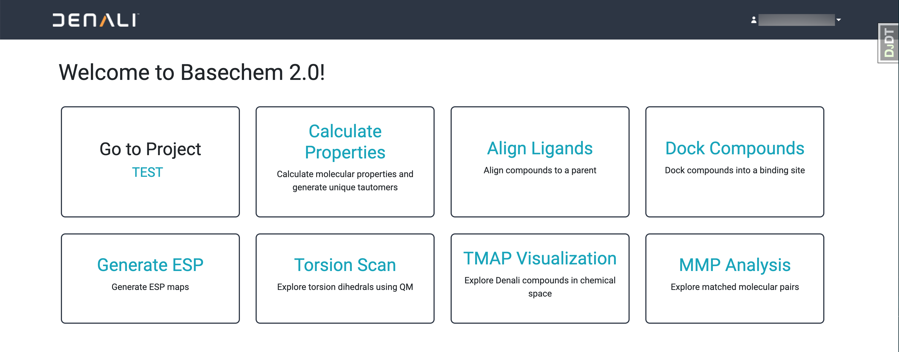

Welcome to Basechem 2.0
=================================
This repository contains the source code for Basechem - a computational chemistry web application used for guiding design ideation! 
Basechem can perform the following analyses: 
- Property calculation 
- Ligand overlay to a reference compound
- Docking to a receptor
- Electrostatic surface potential mapping
- Torsion scanning
- MMP analysis 

Instructions for a new developer:   
=================================

1. Clone this repository:
	- `$ git clone https://github.com/denalitherapeutics/basechem.git`
	- `$ git submodule init`
	- `$ git submodule update`
2. Open a terminal in VS Code and make sure docker is running:
	- `$ docker run hello-world`
	- If you see the success message, great! If not, you need to resolve issues with your Docker installation first.
3. Copy the contents of `deployment/.env.example` file to a new file `deployment/.env.dev`
4. Replace all the "xxx" values with your own values. Some features will only work when values are supplied and un-commented for the "Optional" fields at the bottom. For a basic local Basechem instance, you shouldn't need to supply any of the "Optional" fields.
5. Compose up the docker image:
	- If using VS Code, right click on the `docker-compose.dev.yml` file and click "Compose Up".
	- Otherwise you can compose up using `docker-compose -f "docker-compose.dev.yml" up -d --build`
6. You should see two containers running, `basechem_dev:latest` with the webserver, and a postgres container with a development DB. At this point you should be able to login with the `ADMIN_USER` and `ADMIN_PASSWORD` that you set in `deployment/.env.dev`. Once logged in, you should be directed to the home page:

	

	"Calculate Properties" should be working now. To use the other analyses in Basechem, please read the section on "Setting up Series and Projects"

* If you want to add your own logo, replace basechem/mni_common/static/mni_common/images/company-logo.png with your preferred logo.

Setting up Series and Projects
==============================
Many of the tools in Basechem are based on comparing candidate molecules to a series lead within a project. "Project A" might have two different series of molecules, "Series 1" whose central structure has 3 rings and "Series 2" whose central structure has 2 rings. New molecules uploaded to Basechem are automatically assigned to the series that is most similar, and that series is used by default for alignment and docking tasks. To add a new Project:
1. Navigate to the Django admin panel (http://localhost:8000/admin/)
2. Select "Projects" from the menu
3. Click "Add Project" in the top right corner
4. Fill out the required fields:
	- **Code:** the name for this Project that will appear in forms
	- **Target:** what molecules in this project are targeting. This is only relevant for the assay emailer, so consider repeating the **Code** if this field is not applicable
	- **Leads:** a selection of users who are should recieve all email notifications for this project. This is only currently relevant for the assay emailer.
5. Click "Save" at the bottom of the page

A Series is defined as a lead molecule that should be used as a reference compound in analyses. To add a Series for a Project:
1. Navigate to the Django admin panel (http://localhost:8000/admin/)
2. Select "Series" from the menu
3. Click "Add Series" in the top right corner
4. Fill out the required fields:
	- **DN ID:** the registration ID for this compound (ex: Dotmatics compound ID)
	- **Name:** the name of this Series that will appear in forms
	- **Project:** the Project this Series is for
	- **Smiles:** a SMILES encoding of this compound
	- **Ground state file:** an SDF file with only one 3D conformation of this compound in its ground state. This file is not required if you provide a **Bound state file**
	- **Bound state file:** an SDF file with only one 3D conformation of this compound in its bound state. This file is not required if you provide a **Ground state file**
5. Fill out optional fields:
	- **Receptor file:** a PDB file with the receptor for this compound without a ligand bound. Ideally the structure in this file is in its bound conformation, when bound to the **Bound state file**. This file is required for docking.
	- **Receptor residues:** a comma separated string of residues that are involved iin the binding pocket. These residues will be displayed in more detail in the viewer instead of as a cartoon (ex: "123, 512")
	- **Receptor file mol2:** a mol2 file with the receptor for this compound. Ideally this is just the **Receptor file**, converted to mol2. This file is required for docking.
6. Click "Save" at the bottom of the page

For those who want more info on... 
=================================
## On Toklat 
Toklat is a collaborative effort between Denali Therapeutics, NICO TX, and InductiveBio to rescore docking poses using ML based methods. More information will be released however the source code is available 
as part of Basechem and is utilized in rescoring RDock poses within this application. 

## On Gypsum-DL
We have included Gypsum-DL from the Durrant Lab as a submodule of Basechem in order to prepare molecules by enumerating possible states and generating an initial single 3D conformer for each state. 
https://github.com/durrantlab/gypsum_dl

Ropp, Patrick J., Jacob O. Spiegel, Jennifer L. Walker, Harrison Green, Guillermo A. Morales, Katherine A. Milliken, John J. Ringe, and Jacob D. Durrant. (2019) "Gypsum-DL: An Open-source Program for Preparing Small-molecule Libraries for Structure-based Virtual Screening." Journal of Cheminformatics 11:1. doi:10.1186/s13321-019-0358-3.

## MayaChemTools
Python scripts from [MayaChemTools](http://www.mayachemtools.org/) are used to run torsion scans and generate torsion alerts. MayaChemTools is installed for you in the base Dockerfile, and the scripts are located by default at `/opt/mayachem/bin`. However, if you are using a Slurm cluster for torsion scans, you also need to add the following files to a shared location accessible to bot your basechem instance and your slurm cluster (ex: EFS mount):
1. Download MayaChemTools and update `MAYACHEMTOOLS_DIR` in the .env
2. Download conda and update `MAYACHEMTOOLS_ENV` in the .env
3. Create a conda environment with MayaChemTools requirements and update `MAYACHEMTOOLS_CONDA_EXEC_PATH`

## Bulk admin commands 
Occasionally admins want to run analyses on all compounds in a project or generate poses for hundreds of compounds. To enable this and not clog the general queue, 
bulk_analysis.py allows admins to run DOCK or ALIGN commands with a provided SDF file. In order to run, an admin must enter into a running container, go into the Django 
shell and run `run_bulk_analysis("filepath", "project_code", "analysis")`. Result file will be saved in the container under the collection folder.

## MMPDB setup
A monthly task will clear and update MMPDB. Setting up initial `cache.smi` and `cache.fragdb` will help make the monthly task smoother. These should be manually created on a first run. After the setup, this code will then update the .smi file to include new compounds and use the cache.fragdb file to speed up fragmenting. The indexing will happen fresh each update.

Steps for initial setup:
1. Generate .smi file for database dump
  - This is a tab separated file with no headers and the format "SMILES\tDNID"
  - The SMILES need to be first washed with RDKit to get rid of weird extra bits
  - Save the initial file in `basechem/common/mmpdb_data/{yourfilename}.smi`
3. Run the following command to fragment the smiles using the matcher_alpha smarts
  - `$  mmpdb fragment $MMPDB_DIR/mmpdb_data/{yourfilename}.smi -o $MMPDB_DIR/mmpdb_data/{yourfile}.fragdb --cut-smarts matcher_alpha --max-rotatable-bonds 20`
  - Fragmenting ~20k compounds takes ~10+ minutes but using a cached file can speed this up.
4. Run the following command to index the fragments into the given database
  - `$ mmpdb index $MMPDB_DIR/mmpdb_data/{yourfile}.fragdb -o postgresql://{DB_USER}:{DB_PASSWORD}@{DB_ENGINE}:5432/mmpdb_bc_{ENV}`
  - Indexing ~20k compounds takes ~15+ minutes and there is no easy way to speed this up right now
5. Make the initial files the starting "cached files" by running these commands
  - `$ cp $MMPDB_DIR/mmpdb_data/{yourfilename}.smi $MMPDB_DIR/mmpdb_data/cache.smi`
  - `$ mv $MMPDB_DIR/mmpdb_data/{yourfilename}.fragdb $MMPDB_DIR/mmpdb_data/cache.fragdb`

NOTE: Tests tagged with "mmpdb" are not checking the correctness of MMPDB results, only that the results are consistent. 
There is a change in MMPDB V3 which caused Basechem code to not return "correct" MMPs. There is a ticket open on MMPDB repo and further Basechem development could
help alleviate this issue. https://github.com/rdkit/mmpdb/issues/63 tracks the unexpected results. 

Additional developer notes
==============================

## On pre-commit
We use [pre-commit](https://pre-commit.com/) to handle linting (black, isort, and pycln). If pre-commit is not already installed on your machine:
1. Run `pip install pre-commit`

Once pre-commit is installed:
2. Run `pre-commit install` to set up the git hooks script. 

That's it! Every time you commit pre-commit will lint the code as configured in .pre-commit-config.yaml. If all checks
pass, the code is committed, if not, you need to `git add` the files modified by linting and commit again. If for some
reason you need to bypass the pre-commit checks, you can use `git commit --no-verify -m "commit message"`.

## On Basechembase image
Basechem has many dependencies and is built on Centos currently. Basechembase is hosted publically on Dockerhub or can be built locally using the following command: 
`docker build . -t basechembase:latest -f deployment/basechembase/Dockerfile`

## On Testing Locally
Before submitting changes, tests must be run locally using the `run_tests.sh` file which will generate a coverage_report.txt file if the tests all pass. This coverage file should be committed to GitHub as part of the final push to a PR. `run_tests.sh` will fail if overall test coverage is less than 85%. Github PR and merge checks will run general linting and can be adapted to also run tests. 

## On Logging
There are two main loggers, `"django"` and `"analytics"`. The django logger should be used for logging errors and warnings for developers to use in debugging. The analytics logger is reserved for logging analytics that are captured in AWS cloudwatch. The analytics logger should be used exclusively by the `Analytics` class, which ensures that all the logging statements follow the same format for cloudwatch parsing. This is where you can find the local logs:
| Environment | Django Logs                                          | Analytics Logs                                          |
| ----------- | ---------------------------------------------------- | ------------------------------------------------------- |
| local       | file: /log/main_debug.log                            | file: /log/analytics.log                                |
| staging     | file: /log/main_debug.log                            | file: /log/analytics.log                                |

## On Debugging in VS Code
To debug the **server** using the visual debugger in VS Code, compose up as usual. Once the server starts, navigate to the "Run and Debug" tab in VS Code and launch the configuration called "Django server". This will attach the debugger to the process running the Django server. Note that the debugger will fail to attach if the Django server has not started so you will need to try launching the debugger again if that happens. You can then place breakpoints in the python code and begin debugging.

To debug the **shell**, first run the command `django_debug_shell` in the container shell INSTEAD of `python manage.py shell`. Then, navigate to the "Run and Debug" tab in VS Code and launch the configuration called "Django shell". This attaches the debugger to the process running the Django shell. You can then place breakpoints in the python code and begin debugging. `django_debug_shell` is an alias defined in the Dockerfile that will allow the debugger to listen to the shell. The debugger will not work if you use `python manage.py shell`.

## On Sentry
While developing Basechem, we used Sentry for application error monitoring. All error logs are automatically sent to Sentry via its Django integration. To enable error monitoring, you must set the `SENTRY_DSN` environment variable. Its value can be found under "Client Keys (DSN)" on the project settings page in Sentry. Errors are tagged with the environment name (e.g. local, test, prod) which allowing filtering for relevant errors in the Sentry dashboard.

## On SSO
Okta authentication can easily be enabled by setting `SAML_IP_METADATA_URL` in the environment to match your Okta app configuration. Otherwise basic authentication can be used by creating users in the Django Admin panel. 

## Slurm jobs
Torsion scans can be run on an AWS Slurm cluster using the REST API provided by the cluster. The use of this API generally requires a token that needs to be refreshed every week (can be via a scheduled task). Jobs on the cluster are run as a `basechem` user and the output files are stored in a directory on the EFS mount. This directory is shared with the web app container such that any input files required for the job can be copied into the shared folder. The directories created from the docker container running the web app are owned by the root user so their ownership is updated as part of the Slurm job so they can be written to by the `basechem` user from a Slurm node. For troubleshooting failed jobs, you should look at the Django Q task status, the input and output files in the shared directory on the EFS mount, read-write permissions on the directory used as the destination for output files, and the job queue and status on the Slurm cluster. Jobs from a dev container are also submitted to the Slurm queue so use caution when submitting jobs during development.

After sshing into a slurm node, helpful commands when debugging slurm jobs are:
- List jobs in the queue
  - `squeue`
- Show all jobs
  - `scontrol show jobs`
- Show details of a job
  - `scontrol show job <job_id>`
- Cancel a job (when stuck in 'stalled' state)
  - `scancel <job_id>`

## RDKit cartridge setup
Basechem includes migrations to set up the RDKit Postgres Cartridge. As long as the RDKit extension is available on the database driver, no further setup is needed.
